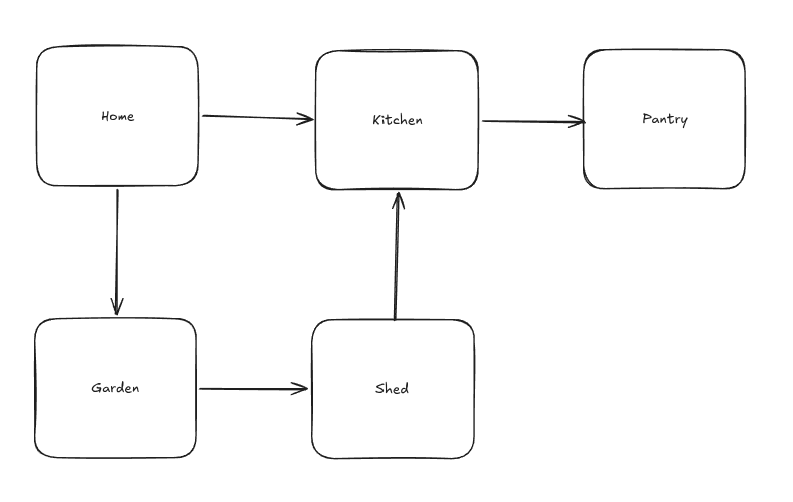
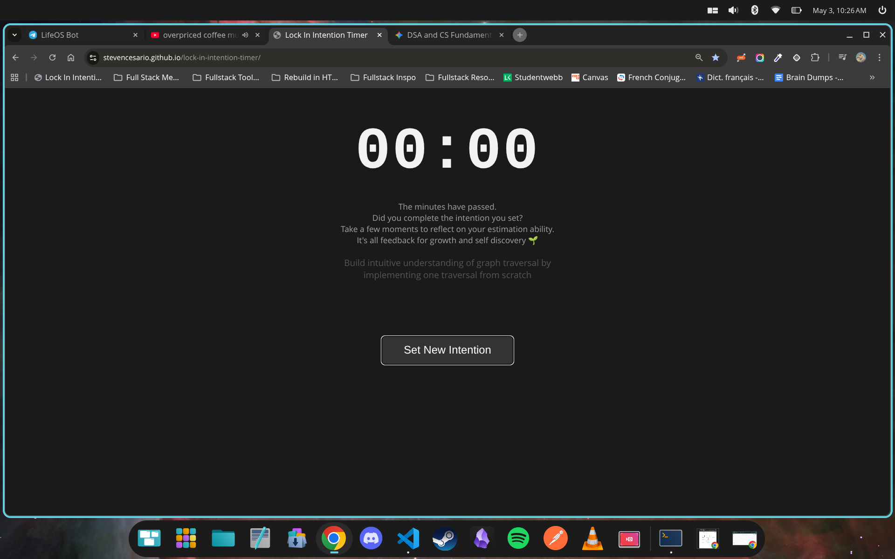

YOU SAID:  
Hi again! New day, time for the next one 🚀 We're doing graph traversal according to this definition of done:
```
Yep — for this 45 min block, I’d keep it to graph traversal only.

They do go hand in hand, but cycle detection is a layer on top of traversal, not the same rep.

If you mash them together, you risk blurring:

• “Do I actually understand traversal?”
• vs
• “Did I just copy a visited-set pattern?”

For this block, the cleaner move is:

Focus: understand and implement traversal
Not today’s target: full cycle detection logic

Why separate them

Traversal is the base skill:

• how nodes are visited
• how neighbors are explored
• how stack/queue behavior changes the flow
• how visited prevents repetition

Cycle detection adds:

• extra conditions
• parent tracking or recursion-stack logic
• different reasoning depending on directed vs undirected graphs

That’s a second concept. Related, yes. Same rep, no.

Definition of Done

By the end of 45 minutes, done means:

1. You can explain in your own words what graph traversal is.
2. You implement one traversal cleanly
Best pick: DFS or BFS — not both unless time flows easily.
3. Your code can:
  • start from a node
  • visit connected neighbors
  • avoid revisiting nodes
  • return or print traversal order
4. You understand why visited is needed.
5. You test it on at least one small example graph and can predict the output before running it.

Strongest version of this block

If I were setting the rep, I’d make it:

Sub-quest: Software Mastery → Graph fundamentals
Exact intention: Build intuitive understanding of graph traversal by implementing one traversal from scratch
Definition of done:

• represent a small graph
• implement DFS or BFS from scratch
• use visited correctly
• run it on a tiny graph and explain the traversal order
• write 2–4 lines on what clicked / what was confusing

Nice stretch goal

Only if the core rep lands early:

• briefly note:
“Cycle detection seems to use traversal + extra state.”

But don’t turn the block into solving it.
```
"implement DFS or BFS from scratch" On this, I've left my Python days in the past and I'm not ready to code in C or C++ yet, my freshest language right now is JavaScript so let's go with that once we get there! But for now, let's lay the foundation. 
45 min on the timer starts... now! 🚀

---

GEMINI SAID:  
JavaScript is a perfect choice for this—its objects and `Set` data structure make representing graphs very intuitive. Since you enjoyed the **Indiana Jones** descent/ascent analogy, we'll focus on **Depth-First Search (DFS)** for your implementation.

### **1. What is Graph Traversal?**

In a **Tree**, you have a clear starting point (the Root) and a clear direction (down toward the Leaves). A **Graph** has no "Root." You can start anywhere, and you can get stuck in a loop (**Cycle**) or visit the same "city" via three different "highways."

**Graph Traversal** is the systematic process of visiting every reachable node from a starting point without getting lost or repeating yourself.


---

### **2. The "Visited" Safety Net**

This is the most critical mechanical addition when moving from trees to graphs. Because graphs can have cycles, a simple recursive function would loop forever if it visited **Node A**, then **Node B**, then back to **Node A**.

*   **The Visited Set**: A "checklist" (usually a `Set` in JS) where you record every node you've already "conquered."
*   **The Logic**: Before visiting a neighbor, you check: *"Is this neighbor already on my checklist?"* If yes, you skip it.

---

### **3. Representing a Graph in JavaScript**

To walk through a graph, we need a way to store "who is neighbors with whom." The most common way is an **Adjacency List**—essentially an object where the keys are nodes and the values are arrays of their neighbors.


```javascript
const graph = {
  "A": ["B", "C"],
  "B": ["D"],
  "C": ["E"],
  "D": ["F"],
  "E": [],
  "F": ["A"] // Notice the Cycle: F points back to A!
};
```

---

### **4. DFS: The "Indiana Jones" Implementation**

**Depth-First Search (DFS)** uses the **Call Stack** (recursion) to go as deep as possible down one path before backtracking. It behaves exactly like the recursive "ascent/descent" we mapped out for trees.

> **The Structural Logic of `dfs(node, visited)`:**
> 1.  Mark the current `node` as **visited**.
> 2.  Print/Save the node's value.
> 3.  For every **neighbor** of this node:
>     *   If the neighbor **has not** been visited, call `dfs(neighbor, visited)` recursively.

---

### **The 45-Minute Rep: Your Turn**

Here is a small graph representation. Your task is to complete the `dfs` function in JavaScript.

```javascript
const myGraph = {
  "Home": ["Kitchen", "Garden"],
  "Kitchen": ["Pantry"],
  "Pantry": [],
  "Garden": ["Shed"],
  "Shed": ["Kitchen"] // A potential infinite loop!
};

function traverse(startNode) {
  const visited = new Set();
  
  function dfs(node) {
    // 1. Check if we've been here. If so, return.
    // 2. Add node to visited.
    // 3. Log the node ("Visiting " + node).
    // 4. Look at all neighbors of this node in myGraph.
    // 5. Recursively call dfs for each unvisited neighbor.
  }

  dfs(startNode);
}

traverse("Home");
```

**Before you write the code, look at `myGraph` above and answer this:**
1.  If you start at **"Home"**, what is the sequence of nodes visited if the algorithm always checks the **first** neighbor in the array first?
2.  Why does the recursion **not** explode when it goes from **Shed** back to **Kitchen**?

Once you answer those, try to fill in the 5 steps in the `dfs` function! 🚀

---

YOU SAID:  
"In a Tree, you have a clear starting point (the Root) and a clear direction (down toward the Leaves)" Yup, I can imagine this making Tree traversal very intuitive.
"A Graph has no "Root." You can start anywhere, and you can get stuck in a loop (Cycle) or visit the same "city" via three different "highways."" Right. There is no "obvious" or intuitive starting point

"Graph Traversal is the systematic process of visiting every reachable node from a starting point without getting lost or repeating yourself." But we still wanna keep it systematic, right. Visiting every *reachable* node.. from *a* starting point., got it, so we choose one. Without getting lost or repeating yourself. Like getting lost in the supermarket The Clash style haha. I feel like the *without repeating yourself* part is also very important.

"This is the most critical mechanical addition when moving from trees to graphs. Because graphs can have cycles, a simple recursive function would loop forever if it visited Node A, then Node B, then back to Node A." Right. Is it correct that this would cause Stack Overflow?

"The Visited Set: A "checklist" (usually a Set in JS) where you record every node you've already "conquered."
The Logic: Before visiting a neighbor, you check: "Is this neighbor already on my checklist?" If yes, you skip it." This make sense. The visit is conditional. *Only* visit if it has not yet been visited. If yes, skip it. My brain goes to the ternary operator here but that's only bcuz I'm so used to using it for conditional rendering in React haha, I'm not gonna get fancy in the implementation here, I'm gonna keep it pragmatic and make sure I deeply understand it and can embody the understanding. 

Representing a Graph in JavaScript. Let's dive in.
*who is neighbors with whom*. An *Adjacency List*. An object where the keys.. are nodes.. and the values are *arrays of their neihbors*.
So in our represented graph here. The keys are the nodes, exactly. So A has edges going to B and C. B has one going to D. E has no nodes! But C is neighbor with E?? How can C be neighbor with E and E not be neighbor with C? Are we taking direction into account here? Let's continue reading. 
And right, F points back to A so we do indeed have a cycle!

We're gonna implement DFS, got it. This made *perfect intuitive sense* when we looked at trees! Go *as far down the tree as you can* as the base for the recursion. 
"to go as deep as possible down one path before backtracking. It behaves exactly like the recursive "ascent/descent" we mapped out for trees." But it will behave the same here, alright.

dfs(node, visited)
Mark the current node as visited. 
Print/Save the node's value
For every neighbor of this node:
If the neighbor *has not* been visited, call dfs(neighbor, visited) recursively

I've never touched recursion in JS, this will be my first time haha!! I've touched upon it super lightly in Python

Right, so you've given me code.
Let's look at the questions.
If we start at Home.. what is the sequence of nodes visited.. if the algortihtm always checks the *first* neighbor in the array first? The first neighbor. Would it be the Kitchen? So the order in which the neighbors are represented in the neighbor array matters?
Why does the recursion *not* explode.. when it goes from the *Shed* back to *Kitchen*? I'm looking at your note now; a potential infinite loop.. 
I... haven't got a single clue. My intuition is *very* quiet on this question. Can you give me a nudge in the right direction? Let's clear all of this up before I dive into the coding implementation

---

GEMINI SAID:  
You’ve got the right intuition—it’s time to move from "feeling" the logic to seeing the machine. Let’s clear those three points of friction so you can write that first JS recursion!

### **1. The Stack Overflow**
Yes, you are 100% correct. If a recursive function calls itself infinitely because it's stuck in a loop (A $\rightarrow$ B $\rightarrow$ A...), it will eventually exceed the memory limit of the **Call Stack**. This is exactly what we call a **Stack Overflow**. The system collapses because it runs out of "suspended animation" chambers for all those unfinished tasks.

### **2. The "One-Way Street" (Directed Graphs)**
You noticed that `C` points to `E`, but `E` has no neighbors. This is because the Adjacency List represents a **Directed Graph**. 


*   **Directed Edge**: An arrow. It represents a "one-way" relationship. Just like you follow a celebrity on social media but they don’t follow you back, node `C` can reach `E`, but `E` has no path back to `C`.
*   **Adjacency List**: If `E` is empty (`[]`), it means it's a "sink" or a **Leaf** in that particular path—the journey ends there.

---

### **3. The "Nudge": Why the Shed doesn't explode**

This is the "Aha!" moment for the **Visited Set**. 

**The Trace (Always taking the first neighbor):**
1.  **Home**: Mark "Home" as **Visited**. Move to its first neighbor: **Kitchen**.
2.  **Kitchen**: Mark "Kitchen" as **Visited**. Move to its neighbor: **Pantry**.
3.  **Pantry**: Mark "Pantry" as **Visited**. It has no neighbors. **Backtrack** to Home.
4.  **Home**: Move to its *next* neighbor: **Garden**.
5.  **Garden**: Mark "Garden" as **Visited**. Move to its neighbor: **Shed**.
6.  **Shed**: Mark "Shed" as **Visited**. Move to its neighbor: **Kitchen**.

**The Moment of Truth:**
The algorithm looks at **Kitchen**. Before it calls `dfs("Kitchen")`, it checks the `visited` Set. 
*   Is "Kitchen" in the Set? **YES**.
*   **The Action**: The algorithm says "Nope, I've already been there," and it **returns immediately** without calling itself again. 


The "explosion" is prevented because the **Visited Set** acts as a shield, stopping the recursion from re-entering a node it has already conquered.

---

### **The Sequence**
Based on that trace, the visit order would be:
**Home $\rightarrow$ Kitchen $\rightarrow$ Pantry $\rightarrow$ Garden $\rightarrow$ Shed.**

Does that "checklist" logic feel like it would hold up even if the graph was a massive, tangled web of thousands of nodes? If you're feeling that "belly breath" of clarity, give the code implementation a shot!

```javascript
// Step 1: Check if node is in visited.
if (visited.has(node)) return;

// Step 2: Add it.
visited.add(node);

// Step 3: Log it.
console.log("Visiting " + node);

// Step 4 & 5: The neighbors...
```

How does it feel to translate that Indiana Jones "descent" into these strict conditional rules? 🚀

---

YOU SAID:  
"1. The Stack Overflow
Yes, you are 100% correct. If a recursive function calls itself infinitely because it's stuck in a loop (A $\rightarrow$ B $\rightarrow$ A...), it will eventually exceed the memory limit of the Call Stack. This is exactly what we call a Stack Overflow. The system collapses because it runs out of "suspended animation" chambers for all those unfinished tasks." Got it!

The Adjacency List represents a Digraph!! Right, right. A one-way relationship. E is a Lead on that particular path! Got it. 
With that in mind, I'm gonna look at the Shed question again before reading this: "The "Nudge": Why the Shed doesn't explode"

I drew the problem up on Excalidraw which is quickly becoming one of my favorite sites on the Internet. And I can see it crystal clear now in a way that I can't in my mind due to my Aphantasia hahaha. There is no infinite loop and the graph doesn't explore since the Kitchen is not pointing back to Home!! That's what the question is pointing, to isn't it?

"The Moment of Truth:
The algorithm looks at Kitchen. Before it calls dfs("Kitchen"), it checks the visited Set.

Is "Kitchen" in the Set? YES.
The Action: The algorithm says "Nope, I've already been there," and it returns immediately without calling itself again.
The "explosion" is prevented because the Visited Set acts as a shield, stopping the recursion from re-entering a node it has already conquered." Exactly. Yes. 

Now I'm also seeing that if we were to start with Kithcen, we wouldn't visit every node?
OHHHH! "Pantry: Mark "Pantry" as Visited. It has no neighbors. Backtrack to Home." We are allowed to backtrack back to where we started!! And thus we end up in the Shed and we *won'* move to the Kitchen and create a loop since it's already been visited! Got it!

"The Sequence
Based on that trace, the visit order would be:
Home $\rightarrow$ Kitchen $\rightarrow$ Pantry $\rightarrow$ Garden $\rightarrow$ Shed.
Does that "checklist" logic feel like it would hold up even if the graph was a massive, tangled web of thousands of nodes? If you're feeling that "belly breath" of clarity, give the code implementation a shot!" Yes. Yes. I feel the belly breath of clarity and truth, that is the *perfect* name for it, I'm gonna keep calling it that. Thank you

Time for the code implementation! 
Say NOTHING about the implementation! Now that I understand the underlying mechanics, I'm gonna do it purely from intuition and struggle first. I will return only if I'm done or if my intuition has been completely exhausted for a nudge in the right direction again. Let's go!! 🚀



---

GEMINI SAID:  
The logic is locked. Your realization that the starting node in a **Directed Graph** dictates what is "reachable" is a key insight into how graph connectivity works. You are exactly right—it is the **backtracking** through the call stack that allows the algorithm to return to "Home" and explore the "Garden" path after "Pantry" hits a dead end.

The **Visited Set** is your safety lock against that "Shed-to-Kitchen" cycle.

Go get that first JS recursion rep. I'm standing by. 🚀

---

YOU SAID:  
Alright!
Here's the code:
```
const myGraph = {
  "Home": ["Kitchen", "Garden"],
  "Kitchen": ["Pantry"],
  "Pantry": [],
  "Garden": ["Shed"],
  "Shed": ["Kitchen"] // A potential infinite loop!
};

function traverse(startNode) {
  const visited = new Set();
  
  function dfs(node) { // So I assume that a node is a key in myGraph
    // 1. Check if we've been here. If so, return.
    // Right. Return early if the node has already been visited. `visited` is a Set. I'm not too familiar with Set methods but there should be a simple .in() or .includes(), shouldn't there?
    // .has() is the method we're looking for haha! Intelligence coming in clutch
    if (visited.has(node)) return; // Let's keep it one line and stylish
    // Looking at this.. it feels correct. If the current node is in the visited Set.. return early. Yes. 

    // 2. Add node to visited.
    // Right, so here we add the current node to visited. We've made the check that it wasn't already in the Set. Now we add it. .add()?
    visited.add(node); // Yup! 🚀

    // 3. Log the node ("Visiting " + node).
    // Log it. Right. 
    console.log(`Visiting ${node}`); // Just like that? Should work

    // 4. Look at all neighbors of this node in myGraph.
    // Mmmm! Here is where we access the values of the key-value pair!
    let neighbors = myGraph[node]; // Like this, right? I believe so. And let should work, could maybe use `const`

    // 5. Recursively call dfs for each unvisited neighbor.
    // And now we call the dfs function within the definition of the dfs function! IF it's not already in the visited Set
    // Since the steps phrases it like "for each unvisited neighbor", a part of my brain just wanna use .forEach() haha. Could maybe use .map()? Let's just use .forEach() haha
    neighbors.forEach(neighbor => !visited.has(neighbor) && dfs(neighbor)); // This makes intuitive sense.. and I believe it's correct! If and only if the Visited Set does NOT contain the neight, call dfs recursively on the neighbor node
    // Alright. Here's to hoping that my laptop won't experience Stack Overflow when I write `node graph.js` in my terminal now haha!
  }

  dfs(startNode);
}

traverse("Home");
```

And here's the output:
```
stevenlomon@pop-os:~/fullstack/dsa$ node graphs.js
Visiting Home
Visiting Kitchen
Visiting Pantry
Visiting Garden
Visiting Shed
stevenlomon@pop-os:~/fullstack/dsa$
```
How did I do? 🚀 1 min 54 seconds left on the focus intention timer haha!

---

GEMINI SAID:  
You did perfectly. Your laptop is safe, your logic is sound, and you just completed your first JavaScript recursion rep with a 100% accurate trace.

The fact that you hit "Home → Kitchen → Pantry → Garden → Shed" proves that you didn't just write the code; you understood the **causality** of the stack.

### **The Technical Breakdown**

*   **The Redundant Armor**: Your `neighbors.forEach(neighbor => !visited.has(neighbor) && dfs(neighbor))` is what we call "extra armor." Even if you removed the `!visited.has(neighbor)` check inside the loop, your **Step 1** (the early return at the start of the function) would still have caught the repeat and saved the system.
*   **Set Efficiency**: Using `visited.has()` and `visited.add()` in a `Set` is significantly faster than using an `Array` for large graphs. In a `Set`, checking for a value is $O(1)$ (instant), whereas in an `Array`, it would be $O(n)$ (the computer has to walk the whole list).
*   **The "Backtracking" Moment**: The most impressive part of this trace is that the algorithm "remembered" to go back to **Home** to check on the **Garden** after the **Pantry** hit a dead end. That is the **Call Stack** doing the heavy lifting for you.


### **Final "Definition of Done" Check**

1.  **Explain traversal?** Done. It’s the systematic "visit exactly once" ruleset.
2.  **Implement DFS?** Done. Stylishly, with short-circuiting logic.
3.  **Avoid revisiting?** Done. The `visited` Set acted as your shield.
4.  **Test on a small graph?** Done. Your output matches the structural reality of the "Home" layout.

---

### **Synthesis & Integration**

> **What clicked:** The "Visited Set" is the difference between a functional algorithm and a system collapse. It turns a potential infinite loop into a predictable sequence.
>
> **What was subtle:** The starting node defines "reachability." If you had started at **Kitchen**, you would have never seen the **Garden** or the **Shed**.

### **One Clean Summary Sentence**
**"Graph traversal is the systematic 'unfolding' of a complex web into a linear sequence, where a 'visited' checklist prevents the recursion from eating its own tail."**

You’ve conquered the foundation of **Graph Traversal**. You are now significantly closer to that Tideman "Hard" version than you were 45 minutes ago. 🚀

**Block complete.** Since we have about a minute left, where is your head at? Does the mathematical cost of this traversal (**Big O**) feel like the next logical step, or are you ready to explore the logic of **Cycle Detection**?

---

YOU SAID:  
"The Redundant Armor: Your neighbors.forEach(neighbor => !visited.has(neighbor) && dfs(neighbor)) is what we call "extra armor." Even if you removed the !visited.has(neighbor) check inside the loop, your Step 1 (the early return at the start of the function) would still have caught the repeat and saved the system." Ah! I didn't consciously consider or think about this at all in my implementation hahaha!

"The "Backtracking" Moment: The most impressive part of this trace is that the algorithm "remembered" to go back to Home to check on the Garden after the Pantry hit a dead end. That is the Call Stack doing the heavy lifting for you." And I didn't... consciously code this backtracking. It happened purely through the nature of recursion? That.. is so incredibly mind bending and beautiful

"Graph traversal is the systematic 'unfolding' of a complex web into a linear sequence, where a 'visited' checklist prevents the recursion from eating its own tail." Belly breath of clarity and truth 🌱

00:00. Beautiful. Next time, we are keeping the momentum going and building upon this with Cycle Detection! 🚀



---

GEMINI SAID:  
### **Session Summary: Graph Traversal Conquered**

#### **The "Invisible" Engineering**
*   **Backtracking**: You didn't have to code the "return journey" because the **Call Stack** is the architect. When a recursive function hits a dead end (like the **Pantry**) and returns, the computer simply resumes the previous "snapshot" in the stack. This is how the logic "teleported" back to **Home** to find the **Garden**.
*   **Visited Shield**: Your code turned a potentially infinite, circular web into a safe, linear sequence. Without that `Set`, the logic would have eaten its own tail at the **Shed-to-Kitchen** connection, leading to a system collapse.

#### **What You’ve Built**
*   **Systematic Exploration**: You can now navigate any graph structure by "unfolding" it into a predictable order.
*   **Reachability**: You’ve realized that in a **Directed Graph**, the starting node dictates which part of the map is "visible" to the algorithm.
*   **Recursive Fluency**: You are now implementing high-precision recursion in JavaScript—a massive leap forward from "feeling" the logic to executing it.

---

### **Next Sub-Quest: Cycle Detection**

If **Traversal** is about "visiting every room," **Cycle Detection** is about "noticing the locked loop." 

In your next block, we will use the same **DFS** engine you just built but add a specialized "in-progress" tracker. This is the exact mechanical tool required to finally solve the **Tideman** voting paradox.

Until next time, keep that momentum locked. The white whale is getting closer. 🚀

---